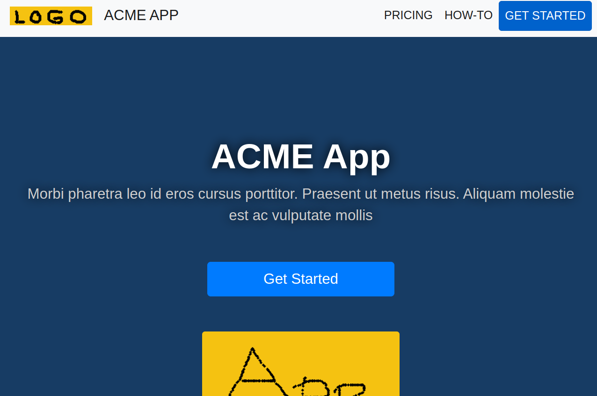

# Landr

A responsive Nextjs / React Bootstrap static landing page starter based on Start Bootstrap Landing Page.



Original codebase was [Start Bootstrap Landing Page](https://startbootstrap.com/theme/landing-page).

## Stack

- [Nextjs](https://nextjs.org)
- [React Bootstrap](https://react-bootstrap.netlify.app)

## Develop

First, run the development server:

```bash
npm install
npm run dev
```

Open [http://localhost:3000](http://localhost:3000) with your browser to see the result.

You can start editing the page by modifying `pages/index.tsx`. The page auto-updates as you edit the file.

Then, build:

```bash
npm run build
```

Your static site is in the `out` directory.
